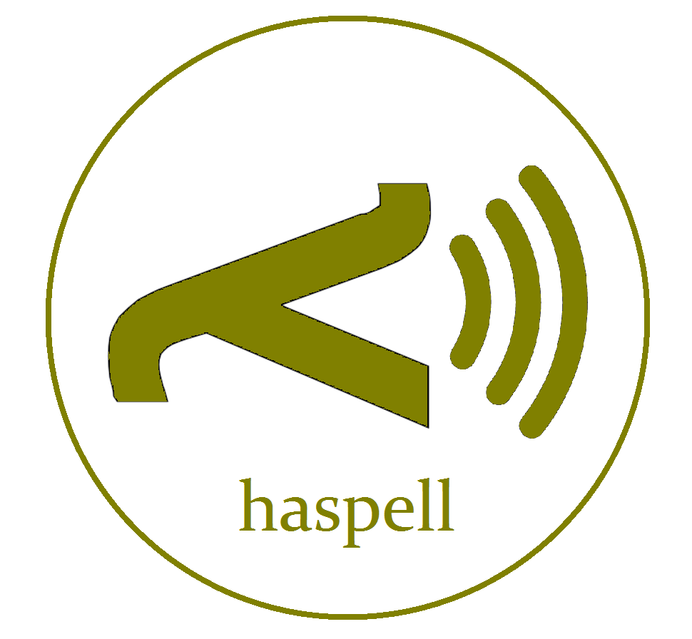

<p align="center">
  
</p>
An awesome text-to-speech engine written in Haskell.
Feel free to break it!

Haspell is in an early stage of development and therefore there are many ways to break it. Here are the ones we know about:

### Wanting to use something that is not there
We have not added handling exceptions yet, so if you want to spell stuff in languages that aren't in your directory, you are in for a nasty surprise.

### Preparing the language improperly
Languages should be stored in a directory with the name of the language. In that directory should be .wav files with all phones the language utilizes, as well as the .hsp file with the same name as the directory.
The .hsp file must have following segments, separated by following tags in separate lines, in the following order:

#### #language
Here is the full name of the language

#### #phones
Here you write down how letters of the text should be transitioned into phones. You do it like this:

regular_expression_in_text -> series,of,the,phones,separated,by,commas

Names of the phones should be corresponding to the names of your .wav files.

##### Example:
```
d -> d
dż -> drz
```

#### #alias
Here you can give aliases to sets of phones of your choice. You can then use those aliases in aliasrules.
Again, names of the phones should be corresponding to the names of your .wav files.

##### Example:
```
<tag1> -> a,b
<tag2> -> c,d,
```
#### #aliasrules

Here you can make rules of transitions of some regular expressions of phones between other expressions of phones.

In this example, consider `<tag1>` and `<tag2>` introduced earlier:

Following aliasrule:
```
<tag1>,k,<tag2> -> $0, g, $1
```
means that Haspell will make transitions between regular expressions into other expressions:
```
a,k,c -> a,g,c
b,k,c -> b,g,c
a,k,d -> a,g,d
b,k,d -> b,g,d
```
`$0` on the right side means that Phonemizer will place the value of the 0th (actually first - we are indexing from 0) tag from the left side (in this case - `<tag1>`) in place of `$0`

### Designing AliasRules that produce infinite loops

A series of phones can correspond to multiple aliasrules - which means it can be changed as many times as needed.

Consider rules:
```
<tag1>,i,<tag2> -> $0,j,$1
<tag1>,j,<tag2> -> $0,i,$1
```
The expression in the beginning is changed into `<tag1>,j,<tag2>` which in turn is changed into `<tag1>,i,<tag2> ` and the process repeats itself infinitely. It is a good practice to make aliasrules which produce results unsuspectible to other aliasrules, so design them with caution!

### Using characters from outside of english alphabet on Windows
For some reason Powershell and .cmd code non-english characters differently than files, so phonemizer treats thaem as different characters. Use Linux instead :)
